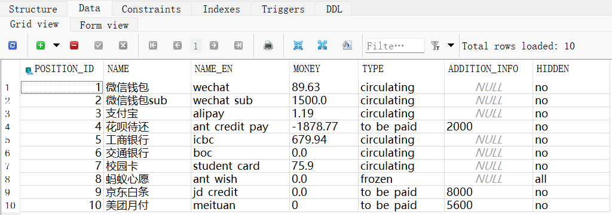
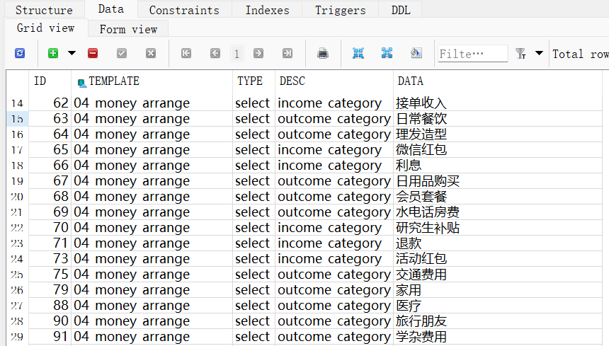
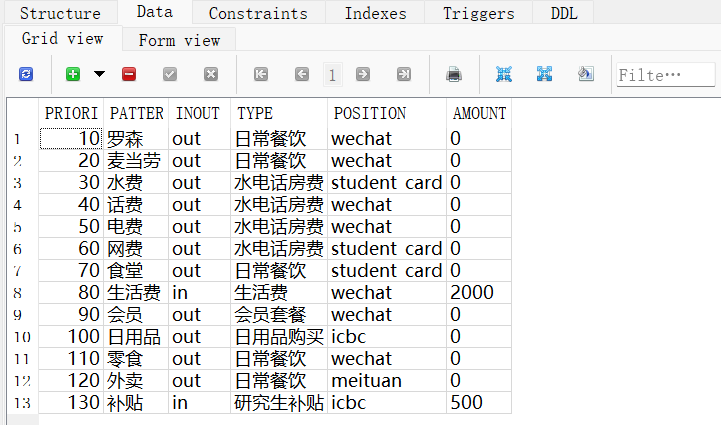

# P4_MoneyArrangeModule
极简个人资金管理系统。

【愿景介绍视频】https://www.bilibili.com/video/BV1Rc411X7FK

【安装说明视频】https://www.bilibili.com/video/BV1hQ4y137QG

【详细文档】更多文档，如`Q&A`、`To_Be_Added`等，详见`wiki`页面。

## 一、运行环境和配置说明

### 1.1、运行环境

- `python 3.8.7`
- `Django 3.2.6`
- `FireFox`浏览器（或任意其他浏览器）

【注】`python`版本和`Django`版本没有非常强制的要求，相近的版本一般也能正常运行。

### 1.2、下载和配置教程

根目录的`install_process`文件夹中给出了所有需要的安装包，也可以自行在相应官网下载。

#### 1.2.1、下载仓库到本地

直接克隆仓库到本地，或者在`release`页面下载均可。

#### 1.2.2、安装`python`

> 如果已经安装过`python`，可以跳过此步骤。

如果没有安装过，可以直接双击`install_process/python-3.8.7-amd64.exe`文件进行安装。

也可以自行在`python`官网（[https://www.python.org/](https://www.python.org/)）下载安装包进行安装。

注意在安装的步骤中，选中`Add python to path`选项，该选项会将`python`路径添加到环境变量中。

#### 1.2.3、安装`django`包和其他依赖

> 如果已经安装过`django`和其他依赖（详见`install_process/requirements.txt`），可以跳过此步骤。

如果没有安装过，可以直接双击`install_process/installPackages.bat`脚本进行`django`及其他依赖库包的安装。

也可以自行输入命令安装。

#### 1.2.4、安装`SQliteStudio`

安装`SQliteStudio`是为了让我们可以通过图形界面修改数据库中的数据。

`windows`系统可以直接双击`install_process/SQLiteStudio-3.4.4-windows-x64-installer.exe`安装。

也可以自行在`sqlitestudio`官网（[https://sqlitestudio.pl/](https://sqlitestudio.pl/)）下载安装包进行安装。

#### 1.2.5、浏览器

我偏向于使用火狐浏览器并切暗色环境，这样界面看起来比较好看，也可以和常用的`Chrome`浏览器开其他网页分隔开。

当然，你也可以使用任何你喜欢的浏览器。

如果你使用其他浏览器，请修改`showPages.bat`脚本中的`firefox.exe`。

### 1.3、运行程序

直接双击`runProject.vbs`脚本，即可运行程序，并自动在浏览器中打开。

## 二、初始化设置

### 2.2.1、`money_position`表

该表位于数据库中，记录了资金存放位置的信息。初始时将资金位置信息填入此即可。

### 2.2.2、`select_list`表

该表记录了资金的收入和支出的类型。初始时将收支分类信息填入此即可。

### 2.2.3、`money_record_auto_complete`表

该表定义了添加记录时自动填充功能的规则，可根据需要进行修改。

> 【注】规则将按照`PRIORITY`从小到大的优先级顺序匹配，不合法的规则将被忽略。

## 三、结语

文档不断完善中，如果有任何问题欢迎联系，或通过`pull request`共同完善。`Have a nice day!`

